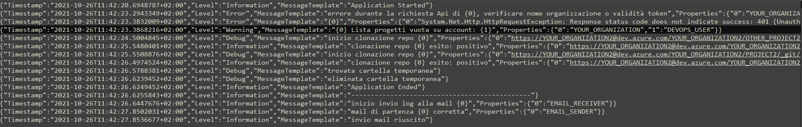
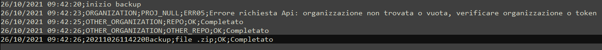

# SMART-BACKUP

Smart-backup is a Powerful console program that allow you to locally backup all repos of your
organizations that you own in Azure DevOps.

The application backups the repos in a local Zip file and with Powerfull integrated log system,
allows you to receive the status of backup progress (info,errors) via:

- console output

- log.txt file

- mail notification  (with SendGrid provider)

***P.S.***

For notification mail this app use SendGrid provider.
You need to have Git, installed on your PC or download from [here](https://git-scm.com/downloads).

## Installation

How to have a nice installation of ***SMART-BACKUP***

- 1. Setup SendGrid for mail:
  - 1.1 View the file [SENDGRID](./SendGrid.md) for installation method;

- 2. Download portable app Windows/Linux from /Program/smart-backupLinux  or smart-backupWin;

- 3. HASH VERIFICATION:

  - 3.1 View the file [HASHVERIFICATION](./HashVerification.md)

- 4. Configure [appsettings.json](./Settings.md)

- 4. Configure **ListOrganization.txt** with your Azure DevOps's organization (*Organization new line new organization!!*)

- 5. Then run the smart-backup.exe (Windows OS) or $: ./smart-backup (Linux OS)*

	***IMPORTANT ONLY FOR LINUX USERS**

	- 5.1 Before run ./smart-backup set authorization:
    - $: chmod 111 smart-backup
    
	- 5.2 ✅ Congratulations you stored your repo localy!! ✅

---
## Output Files

Example Output

- 1. LogAAAAmmGG.txt (json format)

- 2. logMail.txt (csv format)

---

## Contributing

For your question send un email to: nicolas.gentilucci@live.it

## License

smart-backup is Copyright © 2022. It is free
software, and may be redistributed under the terms specified in the
[LICENSE](./License.md) file.