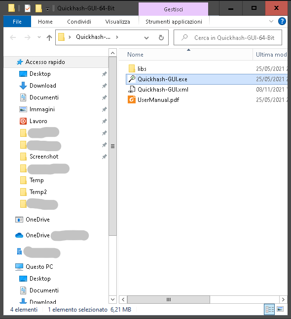
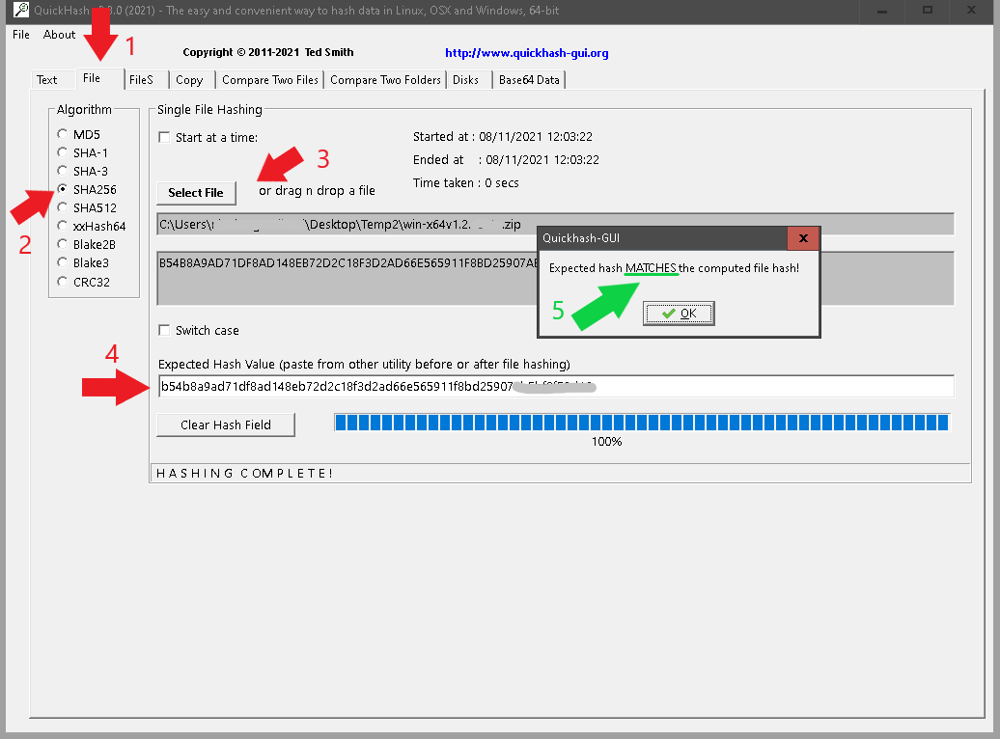

# HASH VERIFICATION

- Go into QuickhashGUI folder and download (on your Desktop) and run **QuickhashGUI** version for your OS;
- If app version, into Release folder is to old, you can dowloaded it from [here](https://www.quickhash-gui.org/downloads/);

	 

- Now click on Tab *File* (1),
- choose *SHA256* (**2**),
- select file *sharepointbackup.ps1* (**3**),
- copy and past hash from *HashSharePointBackupVX.X.txt* into textbox (**4**),
- If popup box say's *MATCHES*, you have download it correctly (**5**).

	
