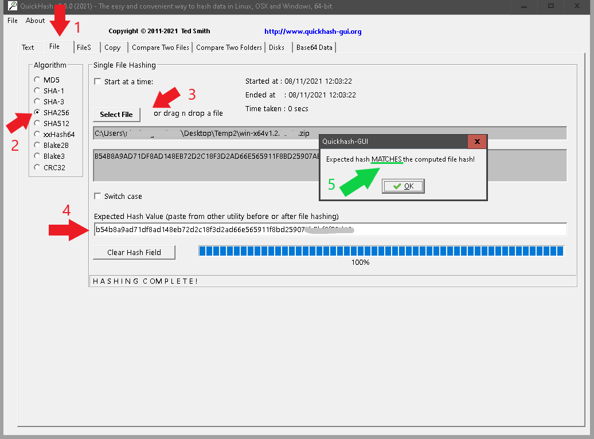

# SMART-BACKUP

Smart-backup is a Powerful console program that allow you to locally backup all repos of your organizations that you own in Azure DevOps.

The application backups the repos in a local Zip file and with Powerfull integrated log system, allows you to receive the status of backup progress (info,errors) via:

- console output
- log.txt file
- mail notification

***P.S.***

For notification mail this app use SendGrid provider.
You need to have Git, installed on your PC or download from [here](https://git-scm.com/downloads).

## Installation

How to have a nice installation of ***SMART-BACKUP***

- 1. Setup SendGrid for mail:
	- 1.1 View the file [SENDGRID](./SendGrid.md) for installation method;

- 2. Download portable app Windows/Linux

- 2.1 Go to [link](https://smartpegeu.sharepoint.com/sites/QualitaSicurezza/Documenti%20condivisi/Forms/AllItems.aspx?id=%2Fsites%2FQualitaSicurezza%2FDocumenti%20condivisi%2FBackupRepository%2FSmartBackup%2FRelease&viewid=d2c01a0c%2D587c%2D4be1%2D9104%2D03321b8e1d5f) and download the portable version for your OS

- 2.2 HASH VERIFICATION:
	- 2.2.1 Go into QuickhashGUI folder and download (on your Desktop) and run **QuickhashGUI** version for your OS;
	- If app version, into Release folder is to old, you can dowloaded it from [here](https://www.quickhash-gui.org/downloads/);

	
  - 2.2.2 
    - Now click on Tab *File* (1),
    - choose *SHA256* (**2**),
    - select file *(Win/Linux)-x64v(X.X).zip* (**3**),
    - copy and past hash from *Hash(Win/Linux)-x64v(X.X).tx*t into textbox (**4**),
    - If popup box say's *MATCHES*, you have download it correctly (**5**).

	

- 2.3 Extract the Zip folder anywhere you want on your PC

- 2.4 First step configure the **appsettings.json**:

---

### **PAY ATTENTION**

It's recommended modify only this parameters:

---

- 2.4 Configure **ListOrganization.txt** with your Azure DevOps's organization (*Organization new line new organization!!*)

- 2.5 Then run the smart-backup.exe (Windows OS) or $: ./smart-backup (Linux OS)*

***IMPORTANT ONLY FOR LINUX USERS**

- 2.6 Before run ./smart-backup set authorization:

    - $: chmod 111 smart-backup

- 2.8 ✅ Congratulations you stored your repo localy!! ✅

---
## Output Files

3. Example Output

- 3.1 LogAAAAmmGG.txt (json format)

- 3.2 logMail.txt (csv format)

---

## Contributing

For your question send un email to: 誰も読まない@こんにちは.jp

## License

smart-backup is Copyright © 2021-2021 Smartpeg. It is free
software, and may be redistributed under the terms specified in the
[LICENSE](documentations/License.md) file.